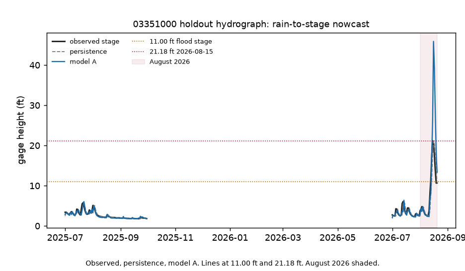
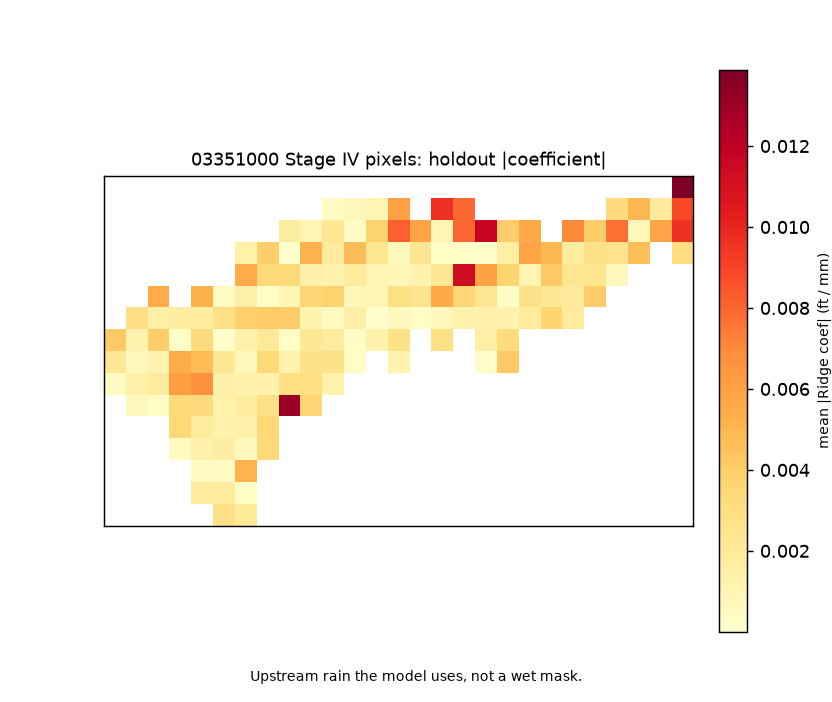

# White River rain-to-stage (Nora)

Does rain on the Nora basin help you guess tomorrow's stage?

Most days, no. Yesterday at Nora is still closer (RMSE 1.03 ft). Rain-sum plus yesterday's discharge is 2.58. The 178-pixel Ridge is 3.19 RMSE and 0.84 MAE (the simple rain sum is 0.83 MAE). With 89 summer training days there are not enough events for Stage IV pixels on the 1,219 mi² Nora drainage to beat yesterday at USGS 03351000, and a linear rain sum overshoots the 15 Aug crest.

So this is not "rain pixels found the flood." It is "today looks like yesterday, and the Ridge does not beat that."

Live negative result is commit `e41fd69`. This tree does not read `p_sfha`. The fixture beating persistence only shows the synthetic hotspot is recoverable. It does not rescue live skill. Attribution should not be read as a runoff map.

Sibling HAND paint: https://github.com/martialsystems/white_river_stage_inundation  
Sibling map-completion: https://github.com/martialsystems/indiana_flood_completion



Figure 1. Live holdout at USGS **03351000**: observed stage, persistence, and the 7-feature Ridge (basin-mean rain lags 0 to 3, last-day Q, day-of-year). Lines at 11.00 ft and 21.18 ft. August 2026 shaded. Persistence is the bar.



Figure 2. Where Ridge looks, not source areas for the flood. A model that loses to persistence should not be read as a runoff map.

## Why this was expected, and still worth shipping

178 cells on 89 days is a wide, short matrix. The two-feature rain-sum model beating Ridge is the tell.

Daily Stage IV versus daily-max stage ignores travel time on 1,227 mi².

Summers plus one huge crest in holdout will punish any linear rain term.

NLDI 1,227 versus USGS 1,219 mi² is close enough with the basin sha pinned. DV 00065 empty, then IV daily max, was the right fallback. Siblings untouched.

## Live skill (holdout)

Locked from `e41fd69` / `logs/nora_live/stage_c_report.json`. RMSE and MAE in feet. Train n=89 (WY2024 summer). Holdout n=143. August 2026 not in train. Native Stage IV units: inches, stored as mm. Label: IV daily max. 235 Stage IV days, 178 HRAP cells.

| Model | RMSE (ft) | MAE (ft) |
|-------|----------:|---------:|
| Persistence | 1.03 | 0.50 |
| Climatology | 3.42 | 1.49 |
| Rain-sum + Q_lag | 2.58 | 0.83 |
| 178-pixel Ridge | 3.19 | 0.84 |

## Next tree, if any

Longer years plus a routed or lagged basin-mean rain term. Not more pixels, and not a wet mask. Persistence stays the bar. Do not start that tree from this commit.

## Stage 0

Synthetic 8×10 basin so CI trains without NOAA. Fixture skill (A RMSE 0.37 ft vs persistence 0.54 ft) is an oracle that the pipeline can recover a planted hotspot. It is not live skill.

```bash
python3.12 -m venv .venv
source .venv/bin/activate
pip install -r requirements.txt
PYTHONPATH=src:. python3 scripts/run_fixture.py logs/stage0_fixture
.venv/bin/python -m pytest tests -q
PYTHONPATH=src:. python3 scripts/run_live.py logs/nora_live
```

Do not use stock `/usr/bin/python3 -m pytest`: it has no rasterio. HTTP 404 or an empty Stage IV cube stops (`run_live.py` exit 2). Daymet and PRISM are not substitutes. Two figures max, then this tree stops.

| File | Role |
|------|------|
| [METHODOLOGY.md](METHODOLOGY.md) | Locked contract |
| [AGENTS.md](AGENTS.md) | Agent rules |
| [CHECKLIST.md](CHECKLIST.md) | Operator list |
| `src/rainstage/` | Basin, Stage IV clip, models A/B, figures, claims |
| `rainforge/` | GraphForge pin: no `p_sfha`, temporal split, fetch-or-stop, claim bans |

Research index: https://gist.github.com/martialsystems/66b896b0a4a0b8cba2b478aef64312f3
